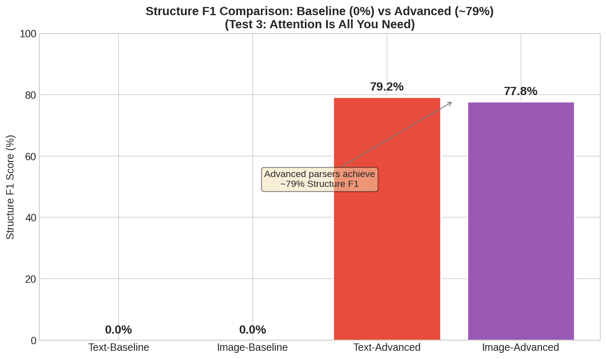
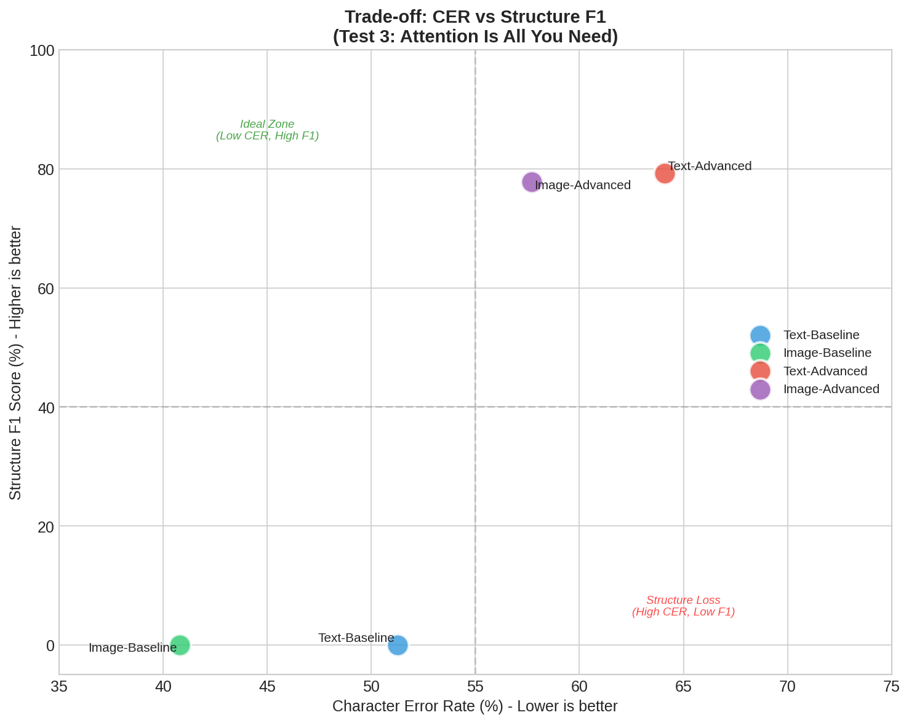

<div align="center">

[](https://www.python.org/)
[](LICENSE)
[](pyproject.toml)

<a href="README.md"></a>
<a href="README.ko.md"></a>

</div>

# 문서 파싱 구조 보존 테스트 프레임워크

> **"파싱 단계에서 손실된 구조는 영원히 손실된다 — 어떤 downstream 최적화도 이를 복원할 수 없다."**

고객사 문서(표 안의 표, 이미지 테이블, 다단 레이아웃)의 RAG 파이프라인을 구축하면서 발견한 인사이트: **파싱 단계가 비가역적 병목**이라는 것입니다. 파싱 과정에서 문서 구조가 손실되면, 이후 어떤 downstream 최적화(청킹 전략 변경, 임베딩 모델 교체, Reranker 추가)로도 복원할 수 없습니다. 이 프레임워크는 기존 OCR 방식과 VLM 기반 구조화 파싱을 전체 파이프라인에 걸쳐 비교하여 해당 가설을 정량적으로 검증합니다.

### 주요 결과

| RQ | 질문 | 지표 | 결과 |
|----|------|------|------|
| **RQ1** | OCR 추출 품질이 VLM 입력으로 충분한가? | CER, WER | Baseline CER 40-51% ✓ (한글 스캔: hallucination 위험) |
| **RQ2** | VLM Two-Stage Parsing이 구조를 더 잘 보존하는가? | Structure F1 | **0% → 79.25%** (Precision 72%, Recall 88%) |
| **RQ3** | 구조 보존이 청킹 품질을 향상시키는가? | BC, CS | BC 0.512, 18개 자연 섹션 경계 |

**Trade-off** (test_3 기준): +79pp Structure F1, +17pp CER 비용, 159배 지연시간

---

## 빠른 시작

```bash
# 의존성 설치
uv sync

# 파서 비교 벤치마크 실행
python -m src.eval_parsers --all

# 청킹 품질 평가 실행
python -m src.eval_chunking --all
```

---

## 목차

- [개요](#개요)
- [주요 기능](#주요-기능)
- [아키텍처](#아키텍처)
- [설치](#설치)
- [사용법](#사용법)
- [평가 지표](#평가-지표)
- [실험 결과](#실험-결과)
- [프로젝트 구조](#프로젝트-구조)
- [설정](#설정)
- [API 참조](#api-참조)
- [기여하기](#기여하기)
- [라이선스](#라이선스)

---

## 개요

### 문제 정의

기존 RAG 파이프라인은 주로 일반 텍스트 추출에 의존하며, 이는 중요한 문서 구조를 보존하지 못합니다:

- **표 구조 손실**: 행-열 관계가 파괴됨
- **다단 오류**: 2단 레이아웃에서 읽기 순서 혼란
- **헤더 계층 손실**: 섹션 관계가 보존되지 않음
- **의미적 단절**: 청킹이 잘못된 위치에서 분리됨

**근본 원인**: 이 모든 증상의 원인은 파이프라인 첫 단계인 **Data Parsing에서의 구조 정보 손실**입니다. 모든 Baseline 파서는 **Structure F1 = 0%** — 텍스트는 추출하지만 마크다운 구조 요소를 전혀 생성하지 못합니다.

### 가설

> 파이프라인의 첫 단계(Data Parsing)에서 구조를 보존하면, 동일한 downstream 처리(청킹, 임베딩, 검색)로도 유의미하게 높은 품질을 달성할 수 있다. 반대로, 파싱에서 구조가 손실되면 어떤 downstream 최적화도 그 한계를 넘을 수 없다.

### 구조화된 데이터 정의

> **구조화된 데이터**란 마크다운 구조 요소(Heading `#`, List `-`/`1.`, Table `|...|`, Code Block `` ``` ``)가 포함된 텍스트를 의미합니다. Ground Truth(GT) 마크다운 파일의 구조 요소 수를 기준으로 측정하며, **Structure F1** (Precision, Recall, F1)으로 정량화합니다.

### 핵심 연구 질문

| RQ | 질문 | 지표 | 역할 |
|----|------|------|------|
| **RQ1** | OCR 추출 품질이 VLM 입력으로 충분한가? | CER, WER | **전제 조건 검증** |
| **RQ2** | VLM Two-Stage Parsing이 문서 구조를 더 잘 보존하는가? | Structure F1 (Precision, Recall) | **핵심 가설 검증** |
| **RQ3** | 구조 보존이 시맨틱 청킹 품질을 향상시키는가? | BC (Boundary Coherence), CS (Chunk Score) | **다운스트림 효과** |

**논리 흐름**: CER/WER 전제 확인 → VLM 구조화 적용 → Structure F1 측정 → BC/CS 다운스트림 검증

<div align="center">



**Fig 1.** Baseline 파서는 문서 구조를 0% 보존하는 반면, VLM 기반 Advanced 파서는 ~79% Structure F1을 달성합니다.

<br>



**Fig 2.** Advanced 파서는 어휘 정확도(높은 CER)를 구조 보존(높은 F1)과 교환합니다 — RAG 파이프라인에서는 가치 있는 트레이드오프입니다.

</div>

> 전체 실험 결과 및 분석은 [Tech Report](docs/tech_report/)를 참고하세요.

---

## 주요 기능

### 4가지 파서 아키텍처

4가지 파서를 사용한 통제 실험 설계: **Baseline**(구조 비보존) vs **Advanced**(VLM 기반 구조 보존)을 **Text**(디지털 PDF)와 **Image**(스캔 PDF) 두 가지 추출 경로에서 비교합니다. 이를 통해 추출 방식과 무관하게 구조 보존의 효과를 분리하여 검증합니다.

| 파서 | 설명 | Stage 1 | Stage 2 |
|------|------|---------|---------|
| **Text-Baseline** | 디지털 PDF 텍스트 추출 | PyMuPDF (`fitz`) | - |
| **Image-Baseline** | 스캔 PDF OCR | RapidOCR | - |
| **Text-Advanced** | 디지털 + VLM 구조화 | PyMuPDF (`fitz`) | Qwen3-VL-2B-Instruct |
| **Image-Advanced** | 스캔 + VLM 구조화 | RapidOCR | Qwen3-VL-2B-Instruct |

### VLM 프롬프트 전략 (v2 — CRITICAL RULES)

프롬프트는 반복 실험을 통해 진화했습니다:

1. **v1 (초기)**: 일반적인 "document structure expert" → Structure F1 = **0%** (헤딩 마커 미생성)
2. **v2 (commit `90d516d`)**: CRITICAL RULES + 명시적 헤딩 레벨 매핑 → Structure F1 = **~79%**
   - System/User 프롬프트 분리
   - "MUST", "NEVER" 강제 지시어 추가
   - 번호 → 마크다운 레벨 매핑 (1→`##`, 2.1→`###`, 3.1.1→`####`)

**교훈**: 2B 파라미터 소형 모델에서는 명시적 규칙("MUST use #")이 암시적 지시("clean markdown")보다 효과적입니다.

### 시맨틱 청킹

LangChain의 SemanticChunker를 사용한 임베딩 기반 경계 탐지:

- **Breakpoint 유형**: percentile, standard_deviation, interquartile, gradient
- **임베딩 백엔드**: Infinity API의 BGE-M3 또는 로컬 sentence-transformers
- **자동 크기 결정**: 의미적 경계에 따라 청크 크기 자동 결정

### MoC 기반 품질 지표 (라벨 불필요)

파싱 구조 보존이 청킹 품질에 미치는 downstream 영향을 측정합니다. MoC 논문(arXiv:2503.09600v2) 기반, **Semantic Distance**를 사용한 구현:

| 지표 | 구현 방식 | 해석 |
|------|----------|------|
| **BC (Boundary Clarity)** | `1 - cosine_similarity(chunk_i, chunk_i+1)` | 높을수록 좋음 (청크 독립적) |
| **CS (Chunk Stickiness)** | 청크 그래프의 Structural Entropy | 낮을수록 좋음 (의존성 적음) |

**참고**: Semantic Distance 기반 BC 점수(0.3-0.5)는 MoC의 Perplexity 기반 점수(0.8+)와 스케일이 다릅니다.

### 3단계 평가 체계

| 단계 | 역할 | 지표 | 설명 |
|------|------|------|------|
| **1단계** | 전제 검증 | CER, WER | 텍스트 추출 품질 확인 |
| **2단계** | 핵심 평가 | Structure F1 (P, R) | 구조 보존 측정 |
| **3단계** | 다운스트림 | BC, CS | 청킹 품질 영향 |

---

## 아키텍처

```
+--------------------------------------------------------------------+
|                     문서 입력 (PDF)                                  |
+--------------------------------------------------------------------+
                                |
            +-------------------+-------------------+
            |                                       |
            v                                       v
+------------------------+             +------------------------+
|     디지털 PDF?         |             |     스캔 PDF?          |
|   (텍스트 레이어 있음)    |             |    (이미지 기반)        |
+------------------------+             +------------------------+
            |                                       |
╔════════════════════════════════════════════════════════════════════╗
║            ★ 파싱 단계 (Bottleneck) ★                            ║
║  구조 보존됨 → 품질이 downstream으로 전파                          ║
║  구조 손실됨 → 복원 불가능                                        ║
╠════════════════════════════════════════════════════════════════════╣
║                                                                  ║
║   +------+------+                         +------+------+        ║
║   |             |                         |             |        ║
║   v             v                         v             v        ║
║ +---------+  +-----------+          +-----------+  +----------+  ║
║ |  Text   |  |   Text    |          |   Image   |  |  Image   |  ║
║ | Baseline|  |  Advanced |          |  Baseline |  | Advanced |  ║
║ | PyMuPDF |  |+VLM 구조화 |         |  RapidOCR |  |+VLM 구조화| ║
║ +---------+  +-----------+          +-----------+  +----------+  ║
║   구조 미보존   구조 보존              구조 미보존    구조 보존     ║
╚════════════════════════════════════════════════════════════════════╝
            |                                       |
            v                                       v
+--------------------------------------------------------------------+
|                    시맨틱 청킹 레이어                                 |
|              (LangChain SemanticChunker + BGE-M3)                   |
+--------------------------------------------------------------------+
                                |
                                v
+--------------------------------------------------------------------+
|              3단계 평가 체계 (Impact Cascade)                       |
|   +-----------+   +------------+   +-----------+   +----------+    |
|   | RQ1:      |   | RQ2:       |   | RQ3:      |   | Future:  |   |
|   | CER, WER  | → | Structure  | → | BC, CS    | → | HR@k,MRR |   |
|   |(전제 검증) |   | F1 (P,R)   |   |(다운스트림)|   |(검색)     |   |
|   +-----------+   +------------+   +-----------+   +----------+    |
|                                                                    |
|   파싱 품질 ──────────────────────→ Downstream 품질                  |
+--------------------------------------------------------------------+
```

---

## 설치

### 사전 요구사항

- Python 3.13+
- CUDA 지원 GPU (VLM 추론용)
- MeCab (한국어 토큰화용)

### 실험 하드웨어

| 구성 요소 | 사양 |
|----------|------|
| GPU | NVIDIA RTX PRO 6000 Blackwell Server Edition × 2 (각 96GB VRAM) |
| RAM | 128GB DDR5 |
| Storage | SSD |

### uv 사용 (권장)

```bash
git clone https://github.com/Hyeongseob91/test-vlm-document-parsing.git
cd test-vlm-document-parsing

# uv로 설치
uv sync

# 한국어 NLP 지원 설치
uv sync --extra korean
```

### pip 사용

```bash
pip install -e .

# 한국어 지원
pip install -e ".[korean]"

# 모든 기능
pip install -e ".[all]"
```

### 외부 서비스

```bash
# 1. 임베딩 API (Infinity + BGE-M3)
infinity_emb v2 --model-id BAAI/bge-m3 --port 8001

# 2. VLM API (Advanced 파서용)
# Qwen3-VL-2B-Instruct를 http://localhost:8005에 배포
```

### MeCab 설치 (Ubuntu)

```bash
sudo apt-get install mecab mecab-ko mecab-ko-dic libmecab-dev
pip install mecab-python3
```

---

## 사용법

### 1. 파서 비교 (CER/WER/Structure F1)

```bash
# 모든 테스트 데이터에 대해 모든 파서 실행
python -m src.eval_parsers --all

# 단일 파일 테스트
python -m src.eval_parsers --input data/test_1/test.pdf --gt data/test_1/gt.md

# Baseline만 테스트 (VLM 기반 Advanced 파서 스킵)
python -m src.eval_parsers --all --skip-advanced

# Text 파서만 테스트 (Image/RapidOCR 파서 스킵)
python -m src.eval_parsers --all --skip-image
```

**출력**: `results/test_X/`에 파싱 결과 파일, `evaluation.json`, `README.md` 요약

### 2. 청킹 품질 평가 (BC/CS)

```bash
# 모든 파싱 결과 평가
python -m src.eval_chunking --all

# 특정 breakpoint 설정 사용
python -m src.eval_chunking --all \
    --breakpoint-type percentile \
    --breakpoint-threshold 90

# Mock 모드 (임베딩 API 없이 테스트)
python -m src.eval_chunking --all --use-mock

# 특정 디렉토리 평가
python -m src.eval_chunking --parsed-dir results/test_1/
```

**출력**: 각 테스트 폴더에 `chunking.json` (파서별 BC/CS 점수)

### 3. Streamlit 대시보드

```bash
streamlit run src/dashboard_analysis.py --server.port 8501
```

---

## 평가 지표

### 1단계: 전제 조건 검증 (CER, WER)

CER/WER은 VLM의 성능 평가 지표가 아니라, **텍스트 추출 품질이 VLM 입력으로 충분한지** 확인하는 전제 조건 지표입니다.

| 지표 | 공식 | 설명 |
|------|------|------|
| **CER** | `(S + D + I) / N` | 문자 오류율 |
| **WER** | `(S + D + I) / N` | 단어 오류율 (형태소 토큰화 적용) |

### 2단계: 구조 보존 (Structure F1)

| 지표 | 공식 | 설명 |
|------|------|------|
| **Precision** | `TP / (TP + FP)` | 생성한 구조 요소가 정확한가? (hallucination 모니터링) |
| **Recall** | `TP / (TP + FN)` | GT 구조 요소를 검출했는가? (누락 모니터링) |
| **Structure F1** | `2 * P * R / (P + R)` | Precision과 Recall의 조화평균 |

**왜 Precision/Recall 분리가 필요한가?**: F1만으로는 과잉 생성(FP)과 누락(FN)을 구분할 수 없습니다. VLM은 hallucination으로 구조를 과잉 생성할 수 있으므로 Precision 모니터링이 중요합니다.

**평가 대상 구조 요소**: Heading (`^#{1,6}\s+`), List (`^[-*+]\s+`, `^\d+\.\s+`), Table (`^\|.+\|$`)

### 3단계: 청킹 품질 (MoC 기반, Semantic Distance)

| 지표 | 공식 | 설명 |
|------|------|------|
| **BC** | `1 - cosine_similarity` | 높을수록 좋음 (청크 독립적) |
| **CS** | `-Σ (h_i/2m) * log2(h_i/2m)` | 낮을수록 좋음 (Structural Entropy) |

---

## 실험 결과

### RQ1: 전제 확인 — CER (test_3, Attention Is All You Need)

| 파서 | CER | WER | 전제 충족 |
|------|-----|-----|----------|
| Text-Baseline | 51.25% | 57.19% | ✓ |
| Image-Baseline | **40.79%** | **41.24%** | ✓ (최선) |
| Text-Advanced | 64.11% | 69.34% | ✓ (+13pp trade-off) |
| Image-Advanced | 57.71% | 63.27% | ✓ (+17pp trade-off) |

**주의**: 한글 스캔 문서(test_1)에서 Image-Advanced CER 536% hallucination 발생.

### RQ2: 구조 보존 — Structure F1 (test_3)

| 파서 | Precision | Recall | F1 | TP | FP | FN |
|------|-----------|--------|-----|----|----|-----|
| Text-Baseline | 0% | 0% | 0% | 0 | 11 | 24 |
| Image-Baseline | 0% | 0% | 0% | 0 | 0 | 24 |
| **Text-Advanced** | **72.41%** | **87.50%** | **79.25%** | 21 | 8 | 3 |
| Image-Advanced | 70.00% | 87.50% | 77.78% | 21 | 9 | 3 |

### RQ3: 다운스트림 효과

- BC score 0.512, 18개 자연 청크 분할 (test_3)
- 마크다운 헤더가 자연스러운 시맨틱 경계 제공

### Trade-off 요약

**왜 이 비교가 필요한가?**: 실무에서는 정확도와 구조화 품질 중 하나를 선택해야 합니다. VLM 구조화는 Structure F1을 +79pp 올리지만, CER은 +17pp 증가하고 처리 시간은 159배 느려집니다.

| 지표 | Baseline (최선) | Advanced (최선) | 차이 |
|------|----------------|----------------|------|
| CER | 40.79% | 57.71% | +16.92pp |
| Structure F1 | 0% | 79.25% | **+79.25pp** |
| Latency | 0.27s | 42.92s | ×159 |

**시나리오별 추천**:
- **속도 우선 (실시간 검색)**: Baseline (0.27-2.3s)
- **구조 우선 (RAG 청킹)**: Advanced (Structure F1 79%)
- **하이브리드**: 문서 복잡도에 따라 라우팅

---

## 프로젝트 구조

```
test-vlm-document-parsing/
├── src/
│   ├── eval_parsers.py          # CLI: 파서 비교 (CER/WER/F1)
│   ├── eval_chunking.py         # CLI: 청킹 평가 (BC/CS)
│   ├── dashboard_analysis.py    # Streamlit 대시보드
│   │
│   ├── parsers/                 # 파서 구현
│   │   ├── ocr_parser.py        # Text-Baseline (PyMuPDF), Image-Baseline (RapidOCR)
│   │   ├── text_structurer.py   # VLM 기반 텍스트 구조화 (Qwen3-VL-2B)
│   │   └── two_stage_parser.py  # Advanced 파서 (Baseline + VLM)
│   │
│   ├── chunking/                # 시맨틱 청킹 모듈
│   │   ├── chunker.py           # LangChain SemanticChunker 래퍼
│   │   ├── embeddings.py        # LangChain 호환 API 임베딩
│   │   ├── metrics.py           # BC/CS 지표 (Semantic Distance)
│   │   └── dashboard_export.py  # 대시보드 데이터 내보내기 유틸리티
│   │
│   ├── dashboard/               # 대시보드 컴포넌트
│   │   └── styles.py            # CSS 스타일
│   │
│   └── evaluation/              # 통합 평가 인터페이스
│       └── __init__.py
│
├── data/
│   ├── test_1/                  # 한국어 정부 문서
│   ├── test_2/                  # 영수증 이미지
│   ├── test_3/                  # 영어 학술 논문
│   └── test_4/                  # 추가 테스트 문서
│
├── results/                     # 평가 출력
│   ├── test_1/
│   │   ├── text_baseline_output.txt
│   │   ├── image_baseline_output.txt
│   │   ├── text_advanced_output.txt
│   │   ├── image_advanced_output.txt
│   │   ├── evaluation.json      # 파싱 지표
│   │   ├── chunking.json        # 청킹 지표
│   │   └── README.md            # 요약
│   └── ...
│
├── docs/
│   └── tech_report/             # 전체 기술 보고서 (9개 섹션 + 부록)
│
├── tests/
│   └── test_chunking_cli.py     # 청킹 모듈 단위 테스트
│
├── pyproject.toml               # 프로젝트 설정
├── README.md                    # 영어 문서
└── README.ko.md                 # 한국어 문서
```

---

## 설정

### VLM 설정

```yaml
vlm_structurer:
  model: "Qwen3-VL-2B-Instruct"
  api_url: "http://localhost:8005/v1/chat/completions"
  temperature: 0.1
  max_tokens: 8192
  prompt_version: "v2"  # CRITICAL RULES + 명시적 헤딩 매핑
```

### 청킹 설정

```python
from src.chunking import ChunkerConfig, create_chunker

config = ChunkerConfig(
    breakpoint_threshold_type="percentile",  # percentile, standard_deviation, interquartile, gradient
    breakpoint_threshold_amount=95.0,        # 임계값
    min_chunk_size=None,                     # 최소 청크 크기 (선택)
)

chunker = create_chunker(
    config=config,
    embedding_api_url="http://localhost:8001/embeddings",
    embedding_model="BAAI/bge-m3",
)
```

### 임베딩 클라이언트 옵션

```python
from src.chunking.metrics import create_embedding_client

# API 기반 (Infinity + BGE-M3)
client = create_embedding_client(
    api_url="http://localhost:8001/embeddings",
    model="BAAI/bge-m3"
)

# 로컬 sentence-transformers
client = create_embedding_client(
    model="jhgan/ko-sroberta-multitask"
)

# 테스트용 Mock
client = create_embedding_client(use_mock=True)
```

---

## API 참조

### 파서 클래스

```python
from src.parsers import (
    OCRParser,          # Text-Baseline (PyMuPDF)
    RapidOCRParser,     # Image-Baseline (RapidOCR)
    TwoStageParser,     # Advanced 파서 (Baseline + VLM)
    TextStructurer,     # VLM 텍스트 구조화
)

# Two-Stage Parser (Advanced)
parser = TwoStageParser(
    structurer_api_url="http://localhost:8005/v1/chat/completions",
    structurer_model="qwen3-vl-2b-instruct",
)

# PDF 타입 자동 감지 후 파싱
result = parser.parse_auto(pdf_bytes)
print(f"내용: {result.content}")
print(f"Stage 1 ({result.stage1_parser}): {result.stage1_time:.2f}s")
print(f"Stage 2 (VLM): {result.stage2_time:.2f}s")
```

### 청킹 및 평가

```python
from src.chunking import (
    SemanticChunker,
    ChunkerConfig,
    evaluate_chunking,
    create_embedding_client,
)

# 텍스트 청킹
config = ChunkerConfig(breakpoint_threshold_type="percentile")
chunker = SemanticChunker(config, embedding_api_url="http://localhost:8001/embeddings")
chunks = chunker.chunk(text, document_id="doc1")

# 청킹 품질 평가
client = create_embedding_client(api_url="http://localhost:8001/embeddings")
metrics = evaluate_chunking(chunks, embedding_client=client)

print(f"BC: {metrics.bc_score.score:.4f}")
print(f"CS: {metrics.cs_score.score:.4f}")
```

---

## 의존성

주요 의존성:

```toml
[project]
dependencies = [
    "PyMuPDF>=1.24.0",           # Text-Baseline 파서
    "rapidocr-pdf>=0.4.0",       # Image-Baseline 파서
    "rapidocr-onnxruntime>=1.4.0",
    "langchain-experimental>=0.3.0",  # SemanticChunker
    "langchain-core>=0.3.0",
    "httpx>=0.27.0",             # API 클라이언트
    "jiwer>=3.0.0",              # CER/WER 계산
    "numpy>=1.24.0",
    "streamlit>=1.45.0",         # 대시보드
    "plotly>=5.18.0",            # 시각화
]
```

---

## 알려진 문제 및 해결 방법

### VLM 환각 (Hallucination)

**증상**: VLM이 원문에 없는 텍스트를 생성하여 CER 급증 (test_1에서 536%)

**해결 방법**:
- CRITICAL RULES 프롬프트 사용 (TextStructurer 내장 v2)
- `max_tokens: 8192` 제한으로 과도한 생성 방지
- `temperature: 0.1`으로 창의성 억제
- 한글 스캔 문서에서는 VLM 적용 전 CER/WER 전제 확인 필수

### BC 점수 스케일 차이

**증상**: BC 점수가 MoC 논문(0.8+)보다 낮음(0.3-0.5)

**원인**: Semantic Distance(1-cosine_similarity)와 Perplexity 기반 접근의 스케일 차이

**해결 방법**: BC 점수 해석 가이드 참고 (0.3-0.5가 정상 범위)

### RapidOCR 한국어 인식

**증상**: 한국어 문서에서 인식률이 낮음

**해결 방법**:
- 스캔 품질 개선 (DPI 증가)
- 한국어 문서는 Text-Advanced 또는 Text-Baseline 우선 사용

---

## 기여하기

1. 저장소 포크
2. 기능 브랜치 생성 (`git checkout -b feature/amazing-feature`)
3. 변경사항 커밋 (`git commit -m 'Add amazing feature'`)
4. 브랜치에 푸시 (`git push origin feature/amazing-feature`)
5. Pull Request 열기

---

## 참고 문헌

- [MoC 논문](https://arxiv.org/abs/2503.09600) - Mixtures of Chunking (BC/CS 지표)
- [LangChain SemanticChunker](https://python.langchain.com/docs/how_to/semantic-chunker/)
- [BGE-M3](https://huggingface.co/BAAI/bge-m3) - 다국어 임베딩 모델
- [PyMuPDF](https://pymupdf.readthedocs.io/) - PDF 텍스트 추출
- [RapidOCR](https://github.com/RapidAI/RapidOCR) - OCR 엔진

---

## 라이선스

MIT License

---

## 인용

```bibtex
@software{document_parsing_structure,
  title = {Document Parsing Structure Preservation Test Framework},
  author = {Kim, Hyeongseob},
  year = {2025},
  url = {https://github.com/Hyeongseob91/test-vlm-document-parsing}
}
```
