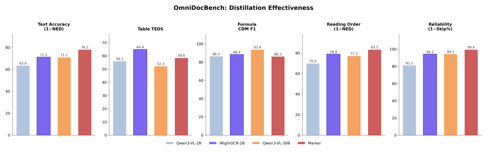
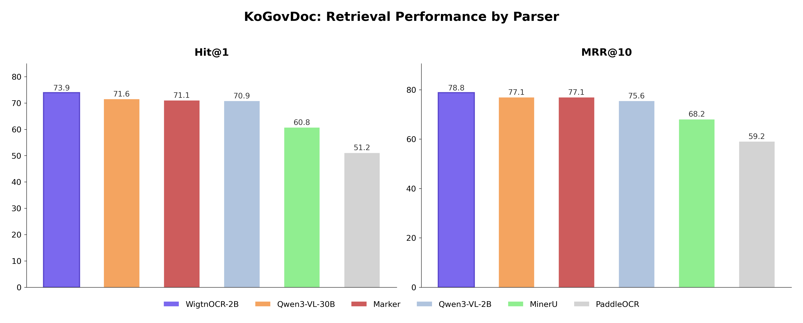
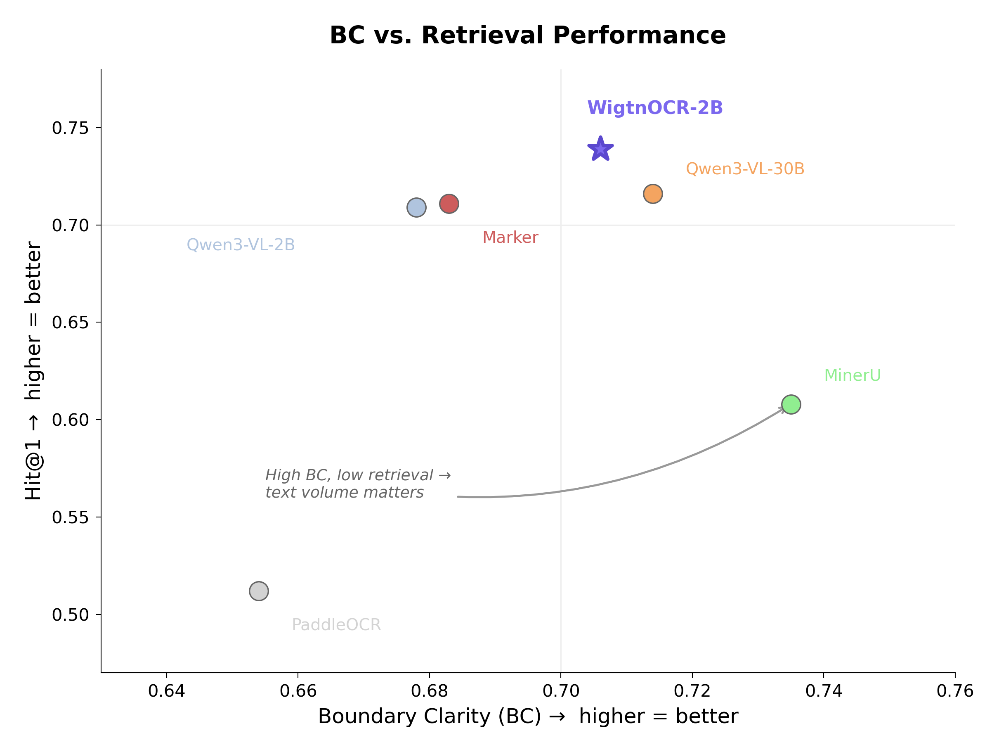
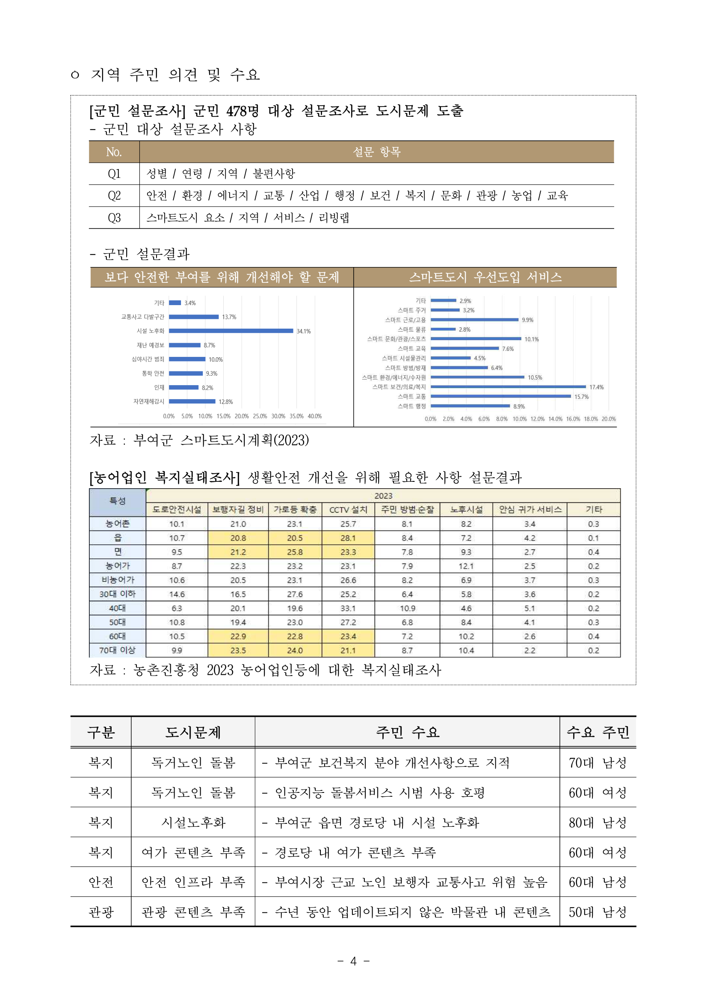

<div align="center">


<br>

[](https://www.python.org/)
[](LICENSE)
[](#)
[](https://huggingface.co/Wigtn/Qwen3-VL-2B-WigtnOCR)

<a href="README.md"></a>
<a href="README.ko.md"></a>

</div>

# WigtnOCR

**Pseudo-Label Distillation 기반 구조 보존 문서 파싱**

> 30B VLM의 문서 파싱 능력을 2B 모델로 증류하고, 구조화된 출력이 한국 정부 문서의 RAG 청킹과 검색 성능을 개선함을 증명합니다.

WigtnOCR은 Qwen3-VL-30B(teacher)의 문서 파싱 능력을 품질 필터링된 pseudo-labeling과 LoRA fine-tuning으로 Qwen3-VL-2B(student)에 증류하는 연구 프레임워크입니다. 증류된 **WigtnOCR-2B**는 OmniDocBench에서 30B teacher를 매칭/초과하며, KoGovDoc에서 6개 파서 중 **최고 검색 성능**을 달성합니다 — **더 나은 파싱 → 더 나은 청크 → 더 나은 검색**.

---

## 주요 결과

### OmniDocBench — 증류 효과

<div align="center">

</div>

| 모델 | Text NED ↓ | Table TEDS ↑ | CDM F1 ↑ | Read Order ↓ | Skip % ↓ |
|------|:----------:|:------------:|:--------:|:------------:|:--------:|
| Qwen3-VL-2B (Base) | 0.364 | 0.561 | 0.865 | 0.300 | 18.8% |
| **WigtnOCR-2B (Ours)** | **0.288** | **0.649** | **0.884** | **0.211** | **5.8%** |
| Qwen3-VL-30B (Teacher) | 0.289 | 0.523 | 0.939 | 0.227 | 5.5% |
| Marker | 0.218 | 0.586 | 0.863 | 0.165 | 0.4% |

**WigtnOCR-2B는 5개 지표 중 4개에서 30B Teacher를 매칭 또는 초과합니다.** Table TEDS는 Teacher 대비 +12.6pp 우위. Skip Rate는 18.8% → 5.8%로 안정성이 대폭 향상되었습니다.

### KoGovDoc — 검색 성능

<div align="center">

</div>

| 모델 | Hit@1 ↑ | Hit@5 ↑ | MRR@10 ↑ | nDCG@10 ↑ |
|------|:-------:|:-------:|:--------:|:---------:|
| **WigtnOCR-2B** | **0.739** | **0.855** | **0.788** | 0.437 |
| Qwen3-VL-30B | 0.716 | 0.839 | 0.771 | 0.411 |
| Marker | 0.711 | 0.853 | 0.771 | 0.412 |
| Qwen3-VL-2B | 0.709 | 0.814 | 0.756 | 0.444 |
| MinerU | 0.608 | 0.789 | 0.682 | 0.384 |
| PaddleOCR | 0.512 | 0.693 | 0.592 | 0.293 |

**WigtnOCR-2B가 Hit@1, Hit@5, MRR@10에서 6개 파서 중 1위입니다.** PaddleOCR(순수 OCR) 대비 Hit@1이 +22.7pp 향상되어, 구조화 파싱이 검색 성능에 직접적으로 기여함을 보여줍니다.

### BC/CS — 청크 품질 ≠ 검색 품질

<div align="center">

</div>

| 모델 | BC ↑ | CS ↓ |
|------|:----:|:----:|
| MinerU | **0.735** | **2.711** |
| WigtnOCR-2B | 0.706 | 2.859 |
| Qwen3-VL-30B | 0.714 | 3.164 |
| Marker | 0.683 | 3.206 |
| Qwen3-VL-2B | 0.678 | 3.446 |
| PaddleOCR | 0.654 | 3.420 |

MinerU가 BC/CS 1위이지만 검색에서는 5위 — 청크 경계 품질만으로는 검색 성능을 예측할 수 없습니다. **텍스트의 풍부함과 구조적 충실도가 end-to-end RAG에서 더 중요합니다.**

---

## 작동 방식

### 증류 파이프라인

```
Stage 1: Pseudo GT 생성
    PDF 페이지 → Qwen3-VL-30B (teacher) → 구조화된 마크다운
    4,501 페이지, 49개 문서 (한국어 + 영어)

Stage 2: 품질 검증
    GT 마크다운 → Qwen3.5-122B (judge, 텍스트 전용) → 점수 1–5
    74–75% 합격률, 5차원 품질 평가

Stage 3: 학습 데이터 준비
    품질 필터링 (점수 ≥ 3) + 편향 보정 + train/val 분할

Stage 4: LoRA 파인튜닝
    Qwen3-VL-2B + LoRA (rank=8, alpha=32) → WigtnOCR-2B
    ms-swift, DeepSpeed ZeRO-2, 3 에폭
```

### 2단계 인과 평가 (KoGovDoc)

```
Step 1: 구조화 파싱이 더 좋은 청크를 만드는가?
    6개 파서 × semantic chunking → BC/CS (perplexity 기반, MoC ACL 2025)

Step 2: 더 좋은 청크가 더 좋은 검색을 만드는가?
    청크 → BGE-M3 임베딩 → FAISS → Hit@K, MRR, nDCG
```

**결과:** 더 나은 파싱 → 더 나은 청크 → 더 나은 검색 (6개 파서에서 검증)

---

## 학습 데이터셋

| 데이터셋 | 문서 수 | 페이지 | 언어 | 출처 |
|---------|:------:|:-----:|:----:|------|
| **KoGovDoc** | 10 | 3,637 | 한국어 | 정부 공공문서 |
| **ArXivPapers** | 39 | 864 | 영어 | arXiv (cs.CL, cs.CV, cs.LG) |
| **합계** | 49 | 4,501 | 이중 언어 | — |

GT는 Qwen3-VL-30B로 생성, Qwen3.5-122B로 검증 (텍스트 전용 judge, 5차원 품질 평가).

---

## 모델

모델 가중치는 HuggingFace에서 제공됩니다:

- **[WigtnOCR-2B](https://huggingface.co/Wigtn/Qwen3-VL-2B-WigtnOCR)** — 배포 모델 (Qwen3-VL-2B + LoRA 파인튜닝)

---

## 출력 예시

한국 정부 문서의 복합 레이아웃 페이지 비교입니다 (kogov_001 p.9 — 설문 테이블 + 통계 차트 + 혼합 레이아웃).

| | 30B Teacher | WigtnOCR-2B (Ours) |
|---|---|---|
| 차트 처리 | `[Figure: ...]` 플레이스홀더 | 데이터를 테이블로 추출 |
| 콘텐츠량 | 1,582 chars | **1,912 chars (+21%)** |
| 테이블 수 | 3개 | **4개** (차트 → 테이블) |

<details>
<summary><b>PDF 원본</b></summary>



</details>

<details>
<summary><b>30B Teacher 출력 (Qwen3-VL-30B)</b> — 1,582 chars</summary>

```markdown
- 지역 주민 의견 및 수요

## [군민 설문조사] 군민 478명 대상 설문조사로 도시문제 도출
- 군민 대상 설문조사 사항

| No. | 설문 항목 |
|-----|-----------|
| Q1 | 성별 / 연령 / 지역 / 불편사항 |
| Q2 | 안전 / 환경 / 에너지 / 교통 / 산업 / 행정 / 복지 / 문화 / 관광 / 농업 / 교육 |
| Q3 | 스마트도시 요소 / 지역 / 서비스 / 리빙랩 |

### - 군민 설문결과

[Figure: 보다 안전한 부여를 위해 개선해야 할 문제]
[Figure: 스마트도시 우선도입 서비스]

자료 : 부여군 스마트도시계획(2023)

## [농어업인 복지실태조사] 생활안전 개선을 위해 필요한 사항 설문결과

| 특성 | 도로안전시설 | 보행자길 정비 | 가로등 확충 | CCTV 설치 | 주민 방범 순찰 | 노후시설 | 안심 귀가 서비스 | 기타 |
|------|-------------|-------------|------------|----------|--------------|---------|----------------|------|
| 농어촌 | 10.1 | 21.0 | 23.1 | 25.7 | 8.1 | 8.2 | 3.4 | 0.3 |
| 읍 | 10.7 | 20.8 | 20.5 | 28.1 | 8.4 | 7.2 | 4.2 | 0.1 |
| 면 | 9.5 | 21.2 | 25.8 | 23.3 | 7.8 | 9.3 | 2.7 | 0.4 |
| 농어가 | 8.7 | 22.3 | 23.2 | 23.1 | 7.9 | 12.1 | 2.5 | 0.2 |
| 비농어가 | 10.6 | 20.5 | 23.1 | 26.6 | 8.2 | 6.9 | 3.7 | 0.3 |
| 30대 이하 | 14.6 | 16.5 | 27.6 | 25.2 | 6.4 | 5.8 | 3.6 | 0.2 |
| 40대 | 6.3 | 20.1 | 19.6 | 33.1 | 10.9 | 4.6 | 5.1 | 0.2 |
| 50대 | 10.8 | 19.4 | 23.0 | 27.2 | 6.8 | 8.4 | 4.1 | 0.3 |
| 60대 | 10.5 | 22.9 | 22.8 | 23.4 | 7.2 | 10.2 | 2.6 | 0.4 |
| 70대 이상 | 9.9 | 23.5 | 24.0 | 21.1 | 8.7 | 10.4 | 2.2 | 0.2 |

자료 : 농촌진흥청 2023 농어업인등에 대한 복지실태조사

| 구분 | 도시문제 | 주민 수요 | 수요 주민 |
|------|----------|-----------|-----------|
| 복지 | 독거노인 돌봄 | - 부여군 보건복지 분야 개선사항으로 지적 | 70대 남성 |
| 복지 | 독거노인 돌봄 | - 인공지능 돌봄서비스 시범 사용 희망 | 60대 여성 |
| 복지 | 시설노후화 | - 부여군 읍면 경로당 내 시설 노후화 | 80대 남성 |
| 복지 | 여가 콘텐츠 부족 | - 경로당 내 여가 콘텐츠 부족 | 60대 여성 |
| 안전 | 안전 인프라 부족 | - 부여시장 근교 노인 보행자 교통사고 위험 높음 | 60대 남성 |
| 관광 | 관광 콘텐츠 부족 | - 수년 동안 업데이트되지 않은 박물관 내 콘텐츠 | 50대 남성 |
```

</details>

<details>
<summary><b>WigtnOCR-2B 출력 (Ours)</b> — 1,912 chars</summary>

```markdown
- 지역 주민 의견 및 수요

[균민 설문조사] 균민 478명 대상 설문조사로 도시문제 도출
- 균민 대상 설문조사 사항

| No. | 설문 항목 |
| --- | --- |
| Q1 | 성별 / 연령 / 지역 / 불편사항 |
| Q2 | 안전 / 환경 / 에너지 / 교통 / 산업 / 행정 / 보건 / 복지 / 문화 / 관광 / 농업 / 교육 |
| Q3 | 스마트도시 요소 / 지역 / 서비스 / 리빙랩 |

- 균민 설문결과

| 보다 안전한 부여를 위해 개선해야 할 문제 | 스마트도시 우선도입 서비스 |
| --- | --- |
| 시설 노후화 | 34.1% |
| 교통사고 다발구간 | 13.7% |
| 자연재해감시 | 12.8% |
| 심야시간 범죄 | 10.0% |
| 통학 안전 | 9.3% |
| 인재 | 8.2% |
| 재난 예경보 | 8.7% |
| 기타 | 3.4% |
| 스마트 보건/의료/복지 | 17.4% |
| 스마트 교통 | 15.7% |
| 스마트 환경/에너지/수자원 | 10.5% |
| 스마트 문화/관광/스포츠 | 10.1% |
| 스마트 근로/고용 | 9.9% |
| 스마트 행정 | 8.9% |
| 스마트 교육 | 7.6% |
| 스마트 방법/방재 | 6.4% |
| 스마트 시설물관리 | 4.5% |
| 스마트 주거 | 3.2% |
| 스마트 물류 | 2.8% |
| 기타 | 2.9% |

자료 : 부여군 스마트도시계획(2023)

[농어업인 복지실례조사] 생활안전 개선을 위해 필요한 사항 설문결과

| 특성 | 도로안전시설 | 보행자길 정비 | 가로등 확충 | CCTV 설치 | 주민 방법순찰 | 노후시설 | 안심 귀가 서비스 | 기타 |
| --- | --- | --- | --- | --- | --- | --- | --- | --- |
| 농어촌 | 10.1 | 21.0 | 23.1 | 25.7 | 8.1 | 8.2 | 3.4 | 0.3 |
| 읍 | 10.7 | 20.8 | 20.5 | 28.1 | 8.4 | 7.2 | 4.2 | 0.1 |
| 면 | 9.5 | 21.2 | 25.8 | 23.3 | 7.8 | 9.3 | 2.7 | 0.4 |
| 농어가 | 8.7 | 22.3 | 23.2 | 23.1 | 7.9 | 12.1 | 2.5 | 0.2 |
| 비농어가 | 10.6 | 20.5 | 23.1 | 26.6 | 8.2 | 6.9 | 3.7 | 0.3 |
| 30대 이하 | 14.6 | 16.5 | 27.6 | 25.2 | 6.4 | 5.8 | 3.6 | 0.2 |
| 40대 | 6.3 | 20.1 | 19.6 | 33.1 | 10.9 | 4.6 | 5.1 | 0.2 |
| 50대 | 10.8 | 19.4 | 23.0 | 27.2 | 6.8 | 8.4 | 4.1 | 0.3 |
| 60대 | 10.5 | 22.9 | 22.8 | 23.4 | 7.2 | 10.2 | 2.6 | 0.4 |
| 70대 이상 | 9.9 | 23.5 | 24.0 | 21.1 | 8.7 | 10.4 | 2.2 | 0.2 |

자료 : 농촌진흥청 2023 농어업인등에 대한 복지실례조사

| 구분 | 도시문제 | 주민 수요 | 수요 주민 |
| --- | --- | --- | --- |
| 복지 | 독거노인 돌봄 | - 부여군 보건복지 분야 개선사항으로 지적 | 70대 남성 |
| 복지 | 독거노인 돌봄 | - 인공지능 돌봄서비스 시범 사용 호평 | 60대 여성 |
| 복지 | 시설노후화 | - 부여군 읍면 경로당 내 시설 노후화 | 80대 남성 |
| 복지 | 여가 콘텐츠 부족 | - 경로당 내 여가 콘텐츠 부족 | 60대 여성 |
| 안전 | 안전 인프라 부족 | - 부여시장 근교 노인 보행자 교통사고 위험 높음 | 60대 남성 |
| 관광 | 관광 콘텐츠 부족 | - 수년 동안 업데이트되지 않은 박물관 내 콘텐츠 | 50대 남성 |
```

</details>

> **핵심 차이:** 30B Teacher는 차트를 `[Figure: ...]` 플레이스홀더로 건너뛰지만, WigtnOCR-2B는 차트 내부 데이터를 구조화된 마크다운 테이블로 추출합니다 — 동일 페이지에서 21% 더 많은 콘텐츠를 생산합니다.

---

## 참고 문헌

- [Qwen3-VL](https://huggingface.co/Qwen/Qwen3-VL-2B-Instruct) — 베이스 VLM
- [ms-swift](https://github.com/modelscope/ms-swift) — 공식 Qwen 파인튜닝 프레임워크
- [MoC](https://arxiv.org/abs/2503.09600) — BC/CS 청킹 품질 메트릭 (ACL 2025)
- [OmniDocBench](https://github.com/opendatalab/OmniDocBench) — 문서 파싱 벤치마크 (CVPR 2025)
- [vLLM](https://github.com/vllm-project/vllm) — VLM 서빙 엔진
- [BGE-M3](https://huggingface.co/BAAI/bge-m3) — 다국어 임베딩 모델
- [PaddleOCR](https://github.com/PaddlePaddle/PaddleOCR) — OCR 베이스라인 (RapidOCR 경유)
- [Marker](https://github.com/VikParuchuri/marker) — PDF→마크다운 변환기
- [MinerU](https://github.com/opendatalab/MinerU) — PDF 파싱 도구

---

## 라이선스

Apache License 2.0

## 인용

```bibtex
@software{wigtnocr2026,
  title   = {WigtnOCR: Pseudo-Label Distillation for Structure-Preserving Document Parsing},
  author  = {Kim, Hyeongseob},
  year    = {2026},
  url     = {https://github.com/WIGTN/wigtnOCR-v1}
}
```
